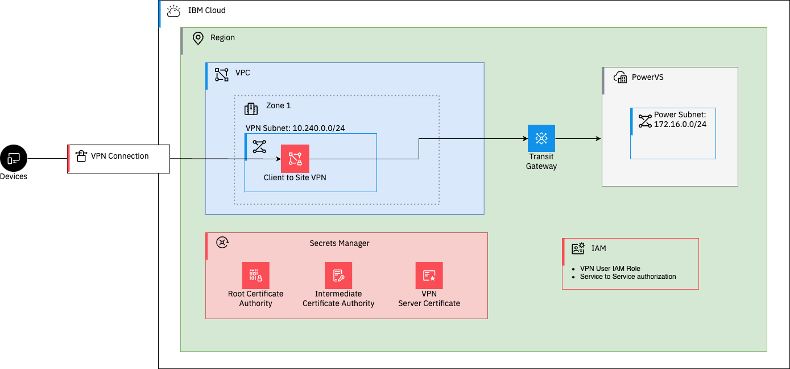

# Overview

Connect on-prem to VPC and PowerVS using Client to Site VPN. 




## Pre-reqs

- [ ] IBM Cloud [API Key](https://cloud.ibm.com/docs/account?topic=account-userapikey&interface=ui#create_user_key)
- [ ] Terraform [installed](https://developer.hashicorp.com/terraform/install) locally

## Getting started

### Clone repository and configure terraform variables

The first step is to clone the repository and configure the terraform variables.

```shell
git clone https://github.com/cloud-design-dev/ibmcloud-vpc-tgw-per.git
cd ibmcloud-vpc-tgw-per
```

Copy the example terraform variables file and update the values with your own.

```shell
cp tfvars-template terraform.tfvars
```

#### Variables

| Name | Description | Type | Default | Required |
|------|-------------|------|---------|:--------:|
| <a name="input_classic_access"></a> [classic\_access](#input\_classic\_access) | Whether to enable classic access for the VPC | `bool` | `false` | no |
| <a name="input_compute_base_image"></a> [compute\_base\_image](#input\_compute\_base\_image) | The base image to use for the compute instance | `string` | `"ibm-ubuntu-22-04-4-minimal-amd64-4"` | no |
| <a name="input_compute_instance_profile"></a> [compute\_instance\_profile](#input\_compute\_instance\_profile) | The profile to use for the compute instance | `string` | `"cx2-2x4"` | no |
| <a name="input_default_address_prefix"></a> [default\_address\_prefix](#input\_default\_address\_prefix) | The default address prefix to use for the VPC | `string` | `"auto"` | no |
| <a name="input_existing_resource_group"></a> [existing\_resource\_group](#input\_existing\_resource\_group) | The name of an existing resource group where the VPC will be deployed. If not provided, a new Resource group will be created. | `string` | `""` | no |
| <a name="input_existing_secrets_manager_instance"></a> [existing\_secrets\_manager\_instance](#input\_existing\_secrets\_manager\_instance) | The name of an existing Secrets Manager instance | `string` | `""` | yes |
| <a name="input_existing_ssh_key"></a> [existing\_ssh\_key](#input\_existing\_ssh\_key) | Name of an existing SSH key in the region. | `string` | `""` | yes |
| <a name="input_ibmcloud_api_key"></a> [ibmcloud\_api\_key](#input\_ibmcloud\_api\_key) | The IBM Cloud API key needed to deploy the VPC | `string` | `null` | yes |
| <a name="input_ibmcloud_region"></a> [ibmcloud\_region](#input\_ibmcloud\_region) | The IBM Cloud region where the VPC, Power, and related resources will be deployed | `string` | `"us-south"` | no |
| <a name="input_power_zone"></a> [power\_zone](#input\_power\_zone) | The zone to deploy the PowerVS instance | `string` | `"dal12"` | no |
| <a name="input_project_prefix"></a> [project\_prefix](#input\_project\_prefix) | The prefix to use for naming resources. If not provided, a random string will be generated. | `string` | `""` | no |
| <a name="input_vpn_client_cidr"></a> [vpn\_client\_cidr](#input\_vpn\_client\_cidr) | CIDR block for VPN clients | `string` | `"172.16.0.0/22"` | no |


### Initialize, Plan and Apply the Terraform configuration

Once you have the required variables set, you can initialize the terraform configuration and create a plan for the deployment.

```shell
terraform init
terraform plan -out=plan.out
```

If no errors are returned, you can apply the plan to create the VPCs, subnets, and compute instances.

```shell
terraform apply plan.out
```

